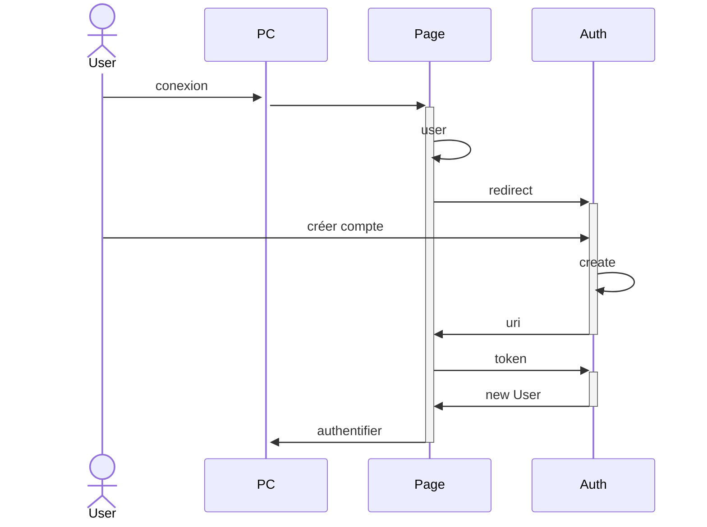
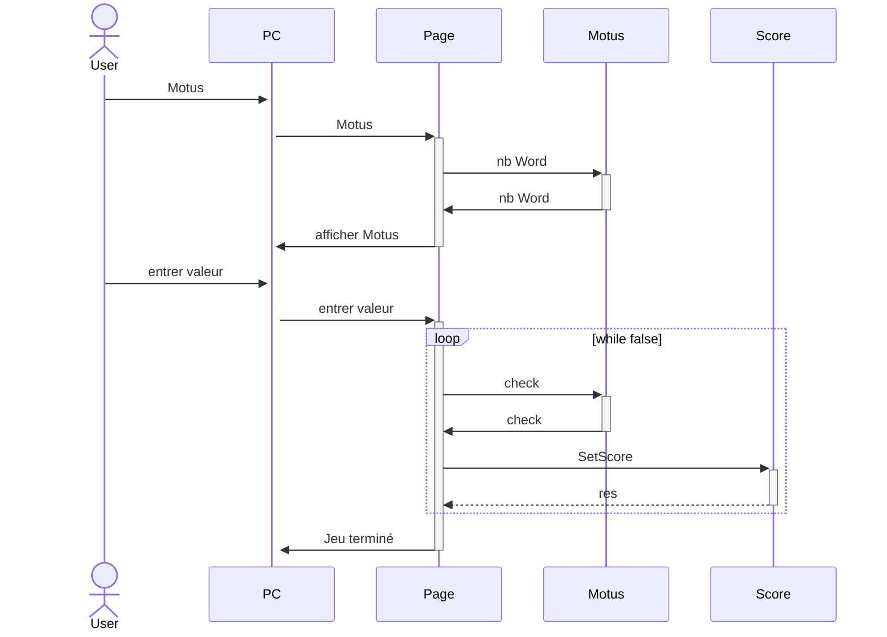
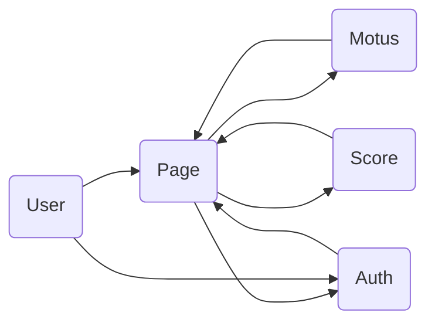

# Projet Microservices
Création d'une application web en utilisant une architecture Microservices.

Ce projet a été réalisé par Philippe Mootz, Duncan Boukhssibi et Marion Pinoit.

## Projet

Le projet consiste a réaliser un jeu de Motus, où l'on peut trouver le mot du jour en 5 essais.
Si le mot est trouvé, le score du joueur va augmenter et le nombre d'essais va être sauvegarder.
Le joueur peut s'identifier à chaque fois qu'il commence à jouer.
Lorsque le joueur se rend sur la page des scores, il peut y voir son score total et sa moyenne du nombre d'essais.

## Etat

Ce qui fonctionne :

- Le jeu du Motus ainsi que le calcul des scores par utilisateurs
- L'authentification pour la création d'un user
- L'authentification depuis un user déjà créé


Nous avons utilisé une base json pour stocker les scores, le nom d'utilisateur, le mot de passe et le nombre de tentatives. Nous avons séparé en deux parties distinctes : mot de passe et scores, nombre de tentatives.
Nous avons réalisé les fonctions permettant d'enregistrer, de modifier et d'obtenir le score ou le nombre d'essais à partir d'un nom d'utilisateur. 
Nous avons aussi réalisé la fonction permettant d'enregistrer un mot de passe avec un nom d'utilisateur ainsi qu'une méthode pour s'assurer que chaque nom d'utilisateur est unique.

Nous pouvons nous déconnecter à tout moment en cliquant sur le nom d'utilisateur situé en haut à droite. Il faudra alors changer de page pour être redirigé vers l'authentification.

Lorsqu'un utilisateur à déjà joué au jeu dans la journée, il ne peut plus y rejouer de la journée. Cependant s'il se déconnecte et se reconnecte il peut à nouveau y rejouer.

Ce qui est en cours :


La sauvegarde de fichier redis ne fonctionne pas totalement lorsque nous le mettons avec le jeu motus. Cela fonctionne uniquement sur l'interface Redis Insight.
Nous n'arrivons pas à accéder au port 4000 que ce soit via axios ou via la requête HTTP malgrès l'existence du port.
Nous avons du repasser sur json pour la base de données afin que ce soit fonctionnel.
La redirection directe vers l'authentification lorsque l'utilisateur a décidé de se déconnecter.
Conserver dans la base de donnée le dernier jour joué par le joueur pour l'empêcher de rejouer.

Avec le redis, le score des 5 meilleurs joueurs et celui de l'utilisateur devraient s'afficher. Cependant, les problèmes que l'on a rencontré avec redis ne nous ont pas permis de réaliser cette étape.

Le haproxy est presque fonctionnel, la configuration est prête mais elle ne s'execute pas totalement.

## Fonctionement du projet

- Télécharger le code sur le gitHub
- Ouvrir un terminal et aller sur le dossier correspondant
- Entrer la commande suivante :
```shell
docker compose up --build
```

Il suffira alors de se rendre sur http://localhost:3010

## Diagrams

Connection à l'application


Jouer au jeux motus


Obtenir son score
 ```mermaid
sequenceDiagram
actor User
    User->>+PC : voir Score
    PC->>+Page : voir Score 
    Page->>+Score : GetScore
    Score->>-Page : res
    Page->>-PC : Afficher Score
```

Représentation des interractions entre api


## Pistes d'améliorations

Pour l'utilisation de Redis nous avons plusieurs pistes d'amélioration. 
La première est que nous avons sur la même base de donnée la partie authentification et la partie score. Nous les avons seulement séparer par des clients différents. Pour les utiliser sur deux bases de données différentes, il faudrait que nous arrivions à utiliser plusieurs url Redis afin de les mettre sur des fichiers js différents.

De plus la fonction permettant d'obtenir le classement des meilleurs joueurs avec leur scores ne fonctionne pas correctement en effet en termes d'affichage sur Redis Insight le score est considéré comme un nom d'utilisateur et apparaît la ligne en dessous du nom de l'utilisateur à qui le score lui est associé.

Modifier le jeu motus afin d'interdire une combinaison de lettres ne formant pas un mot français d'être testé par le programme.

Les connexions sont epu sécurisé ainsi que les sessions, ce qu'on aurait pu améliorer aussi en utilisants les ressources disponibles.
Bien évidement le monitoring n'a pas pu être implémenté, ce qu'on souhaitais faire

Nous avons encore des difficultés à relier les authentifications avec le programme réalisé sur Redis nous avons des erreurs avec les axios et les requêtes HTTP nous n'arrivons pas à accéder au port 4000 malgré sone existence.

Modifier le jeu motus afin d'interdire une combinaison de lettres ne formant pas un mot français d'être testé par le programme.
