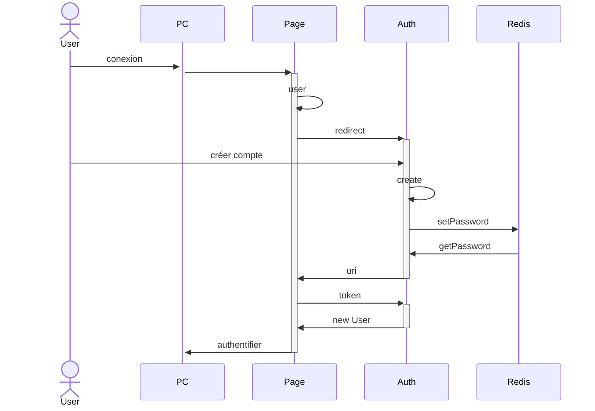
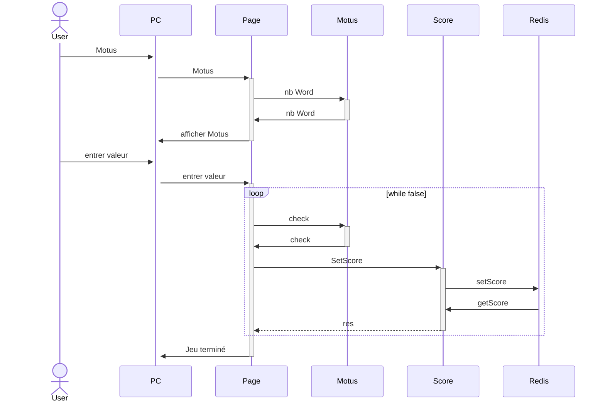
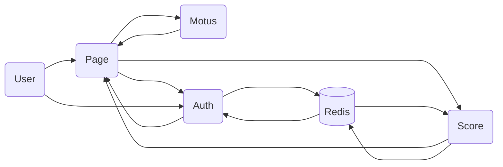

# Projet Microservices
Création d'une application web en utilisant une architecture Microservices.

Ce projet a été réalisé par Philippe Mootz, Duncan Boukhssibi et Marion Pinoit.

## Projet

Le projet consiste a réaliser un jeu de Motus, où l'on peut trouver le mot du jour en 5 essais.
Si le mot est trouvé, le score du joueur va augmenter et le nombre d'essais va être sauvegarder.
Le joueur peut s'identifier à chaque fois qu'il commence à jouer.
Lorsque le joueur se rend sur la page des scores, il peut y voir son score total et sa moyenne du nombre d'essais.

## Etat

Ce qui fonctionne :

- Le jeu du Motus ainsi que le calcul des scores
- L'authentification pour la création d'un users
- La création d'une base de donnée Redis et les fonctions permettant de l'utiliser 


Nous avons réussis à utiliser une base de données rédis pour stocker nos scores, nom d'utilisateur, mot de passe et nombre de tentatives. Nous avons séparer en trois parties distinctes mot de passe scores et nombre de tentatives. Nous avons réalisé les fonctions permettant d'enregistrer, modifier et obtenir le score ou le nombre d'essaies à partir d'un nom d'utilisateur. Nous avons aussi réalisé la fonction permettant d'enregistrer et un mot de passe avec un nom d'utilisateur ainsi qu'une méthode pour s'assurer que chaque nom d'utilisateur est unique.
Cependant elle ne fonctionne pas totalement lorsque nous le mettons avec le jeu motus. Cela fonctionne uniquement sur l'interface Redis Insight.
Nous n'arrivons pas à accéder au port 4000 que ce soit via axios ou requête HTTP malgré l'existence du port.
Nous avons du repasser sur  json pour la base de données pour avoir quelque chose de fonctionnel.


The happroxy is in progress.
For now we use json to store the score and the user. But we want to store it in redis

## Fonctionement du projet

Télécharger le code sur le gitHub
Ouvrir un terminal et aller sur le dossier correspondant
Entrer la commande suivante :
## Diagrams

Connection à l'application


Jouer au jeux motus


Obtenir son score
 ```mermaid
sequenceDiagram
actor User
    User->>+PC : voir Score
    PC->>+Page : voir Score 
    Page->>+Score : GetScore
    Score->>Redis : getScore
    Redis->>Score : 
    Score->>-Page : res
    Page->>-PC : Afficher Score
```

Représentation des interractions entre api


## Pistes d'améliorations

Pour l'utilisation de Redis nous avons plusieurs pistes d'amélioration. La première étant que nous avons sur la même base de donnée la partie authentification et la partie score. Nous avons seulement séparer par des client différents, pour cela il faudrait que nous arrivions à utiliser plusieurs url redis ainsi que de les mettres sur des fichiers js différents. De plus la fonction permettant d'obtenir le classement des meilleures joueurs avec leur scores ne fonctionne pas correctement en effet en termes d'affichage sur Redis Insight le score est considérer comme un nom d'utilisateur et apparaît la ligne en dessous du nom de l'utilisateur à qui le score est associé.
Nous avons encore des difficultés à relier les authentifications avec le programme réalisé sur Redis nous avons des erreurs avec les axios et les requêtes HTTP nous n'arrivons pas à accéder au port 4000 malgré sone existence.

Modifier le jeu motus afin d'interdire une combinaison de lettres ne formant pas un mot français d'être testé par le programme.
