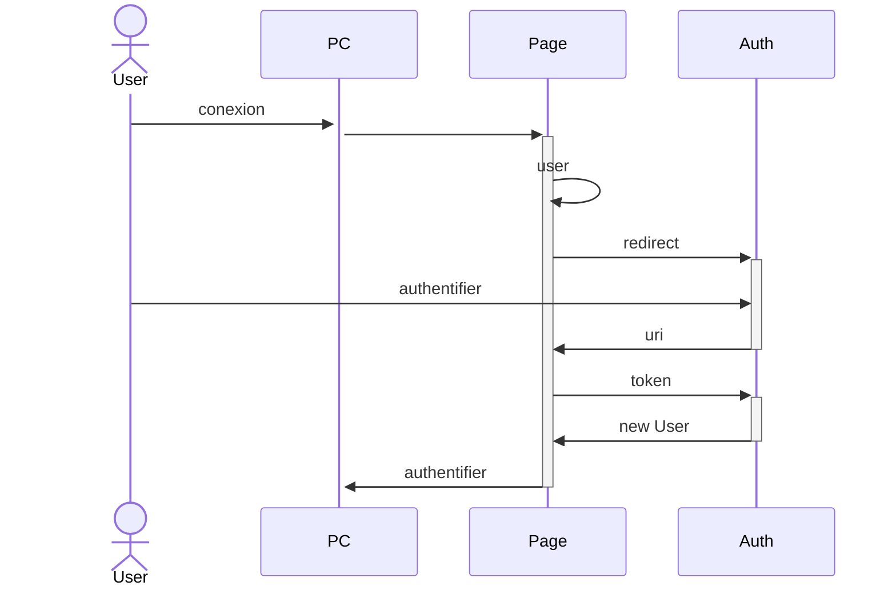
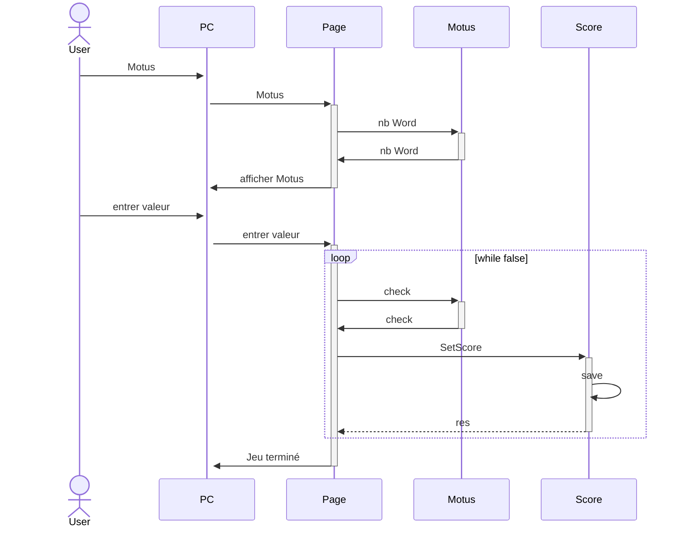
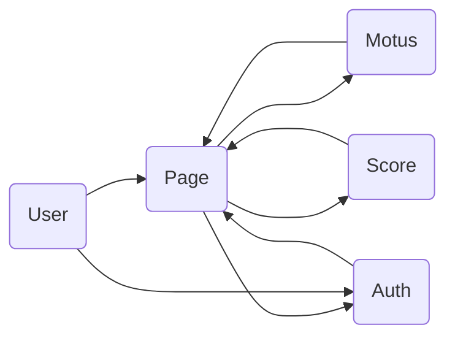

# Projet Microservices
Création d'une application web en utilisant une architecture Microservices.

Ce projet a été réalisé par Philippe Mootz, Duncan Boukhssibi et Marion Pinoit.

## Projet

Le projet consiste a réaliser un jeu de Motus, où l'on peut trouver le mot du jour en 5 essais.
Si le mot est trouvé, le score du joueur va augmenter et le nombre d'essais va être sauvegarder.
Le joueur peut s'identifier à chaque fois qu'il commence à jouer.
Lorsque le joueur se rend sur la page des scores, il peut y voir son score total et sa moyenne du nombre d'essais.

## Etat

Ce qui fonctionne :

- Le jeu du Motus ainsi que le calcul des scores
- L'authentification pour la création d'un users

For now the game and scoring work.
There is an issue with the authentification and more precisely the session storage, we use redis but we have problem.
But we can create an user and authentificate as we want
If this part is solved we will attache the score to the connected user and display it.
We have the docker file for each part of the program, it work for now but I didn't add the redis part so it won't work. The docker-compose is also there.

The happroxy is in progress.
For now we use json to store the score and the user. But we want to store it in redis

## Fonctionement du projet

Télécharger le code sur le gitHub
Ouvrir un terminal et aller sur le dossier correspondant
Entrer la commande suivante :
## Diagrams






 ```mermaid
sequenceDiagram
actor User
    User->>+PC : voir Score
    PC->>+Page : voir Score 
    Page->>+Score : GetScore
    Score->>-Page : res
    Page->>-PC : Afficher Score
```




## Prochaines étapes

Modifier le jeu motus afin d'interdire une combinaison de lettres ne formant pas un mot français d'être testé par le programme.
